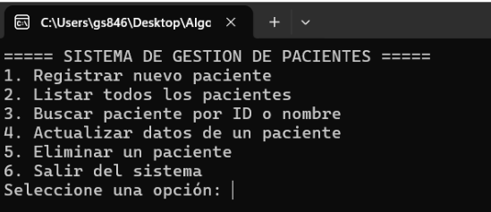
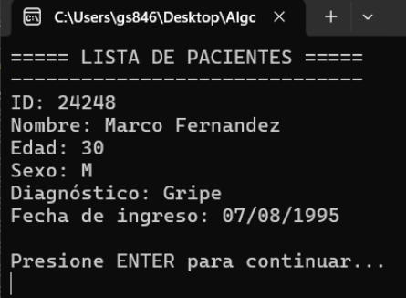
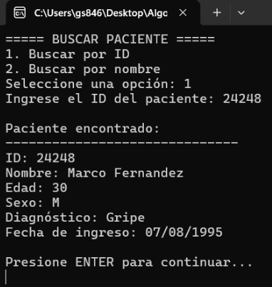
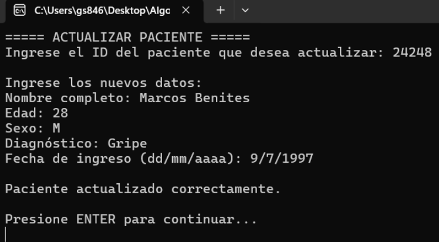
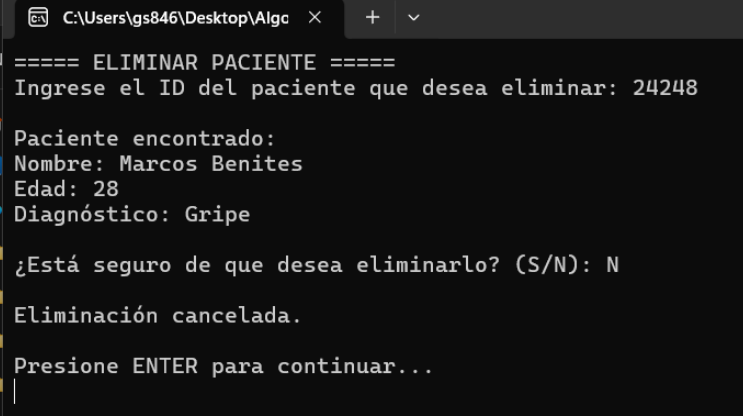

# Sistema de Gestión de Pacientes

## Integrantes
- Genesis Javier Santana  — 25-SSON-2-011
- Marlen Crismel Espinal Almodovar — 25-SSON-2-002

## Descripción breve
El programa es un sistema para gestionar información de pacientes. Permite registrar nuevos pacientes, mostrar los pacientes registrados, buscar información, actualizar datos y eliminar registros. Todo se realiza mediante un menú en consola y utilizando una lista para almacenar los datos.

## Datos de entrada
El usuario puede ingresar datos como:
- ID del paciente
- Nombre
- Edad
- Diagnóstico
- Otros datos utilizados por el programa

## Datos que procesa
El programa permite:
- Registrar pacientes.
- Validar los datos ingresados.
- Buscar pacientes por ID u otro criterio.
- Actualizar información de los pacientes.
- Eliminar pacientes.
- Mostrar la lista de pacientes.

## Datos de salida
El programa muestra en consola:
- Listado de pacientes.
- Confirmaciones de operaciones realizadas.
- Resultados de búsquedas.
- Mensajes de actualización.
- Mensajes de eliminación.
- Mensajes de error cuando los datos son incorrectos.

## Capturas de pantalla
### Menú principal

### Listar todos los pacientes

### Buscar paciente

### Actualizar paciente

### Eliminar paciente

### Lista de pacientes sin registros

### Actualizar paciente - ID no encontrado

